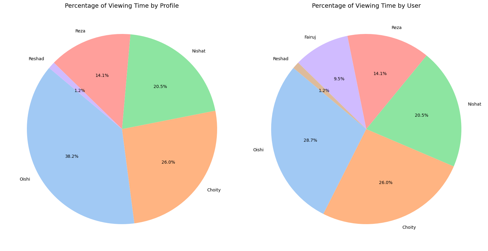
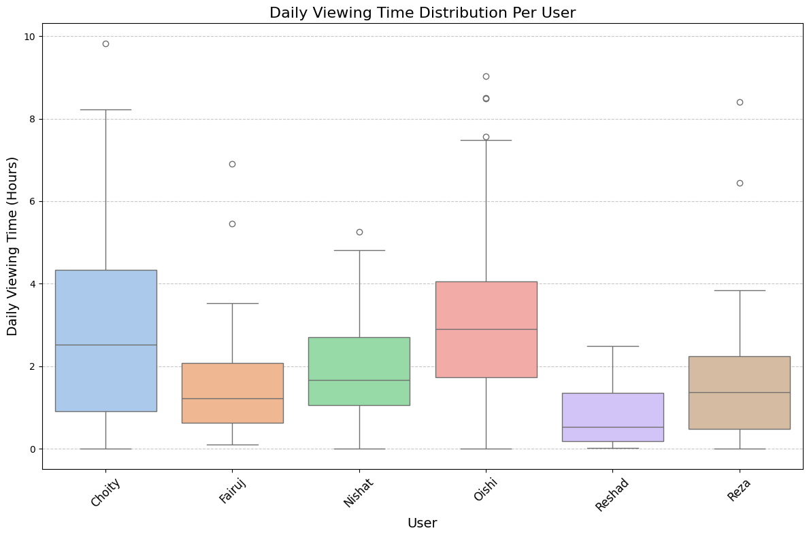
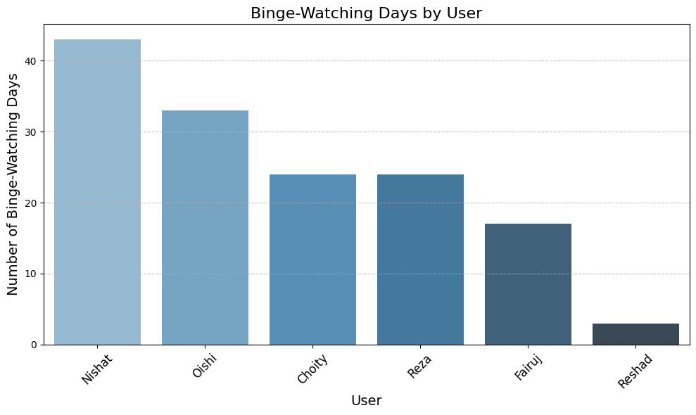
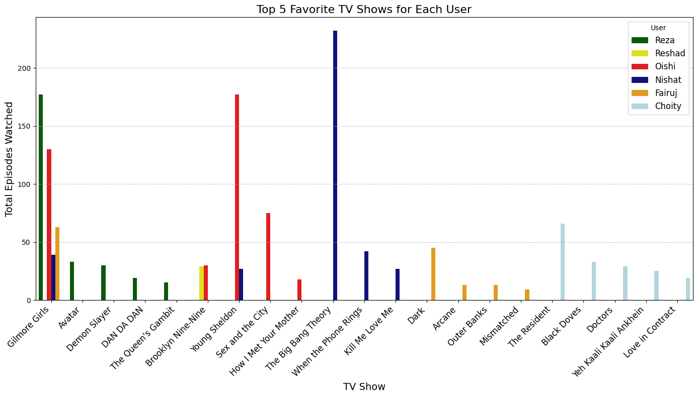
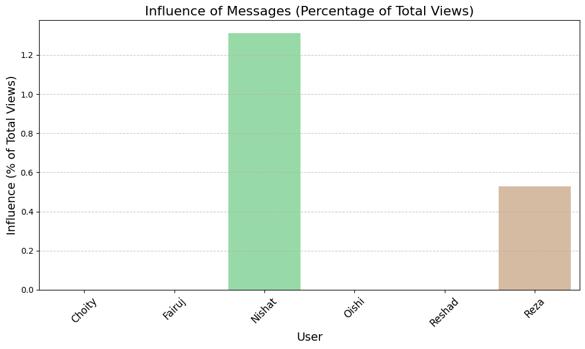

# Netflix Family Usage Analysis

This project explores how my family uses their Netflix account, identifying patterns in viewing habits, binge-watching tendencies, favorite shows, and the effectiveness of Netflix messages. The analysis dives into user behavior and highlights actionable insights.

## Motivation

Have you ever wondered how each family member uses a family Netflix account?  
- **Which profiles are the most active?**  
- **Who’s the biggest binge-watcher?**  
- **Which shows are universally loved across the family?**  
- **Do Netflix messages actually influence users to watch more?**  

This analysis answers all of these questions and more, offering actionable insights for optimizing user experiences and making informed decisions about profile management.

## Key Insights

### 1. Which profiles are the most active?  
- **Oishi's Profile:** The most active, but shared between **Oishi** and **Fairuj**, identifiable by their usage locations (different countries).  
- **Fairuj's Usage:** Regularly uses Netflix but lacks a dedicated profile.  
- **Reshad's Profile:** Minimal activity, making it a candidate for reassignment to **Fairuj** for improved user experience.  

_Left: Viewing time by profile | Right: Viewing time by user_  

### 2. Daily Viewing Patterns  

When it comes to daily viewing:  
- **Choyti** and **Oishi** are the most consistent viewers, averaging 2–3 hours daily.  
- **Reshad** and **Reza** show minimal engagement, rarely exceeding 1 hour/day.  

_Box plot showing daily viewing time distribution per user._  

### 3. Who’s the biggest binge-watcher?  
- **Nishat** is the family’s biggest binge-watcher, with over 40 binge-watching days recorded.  
- **Oishi** and **Choyti** follow closely with 35 and 25 binge-watching days, respectively.  
- The most binge-watched shows include **Gilmore Girls**, **The Big Bang Theory**, and **Young Sheldon**, which are enjoyed across multiple profiles.  

_Bar chart showing the number of binge-watching days for each user._  

### 4. Which shows are universally loved across the family?  
- **Gilmore Girls** stands out as the most loved show, watched consistently across multiple profiles.  
- It was mentioned by family members as a relaxing, feel-good show.  

_Bar chart showing favorite shows by user | Bar chart showing binge-watched shows by users._  

### 5. Do Netflix messages actually influence users to watch more?  
- **Nishat** showed the highest engagement with Netflix messages, with 1.2% of their views influenced by these recommendations.  
- **Reza** also had moderate engagement, while other users like **Oishi** and **Fairuj** showed little to no response to Netflix’s messages.  
- Overall, Netflix messages didn't affect user preferences significantly.  

_Bar Chart: Click-Through Rate (CTR) by Profile | Bar Chart: Influence of Messages on Total Views._  

## Tools and Technologies

- **Python:** For data manipulation and analysis.  
- **Pandas:** To group, aggregate, and filter data.  
- **Matplotlib & Seaborn:** For static visualizations.

## Visualizations

For a detailed walkthrough of all visualizations and their insights, see the [Visualizations README](visualization/README.md).
