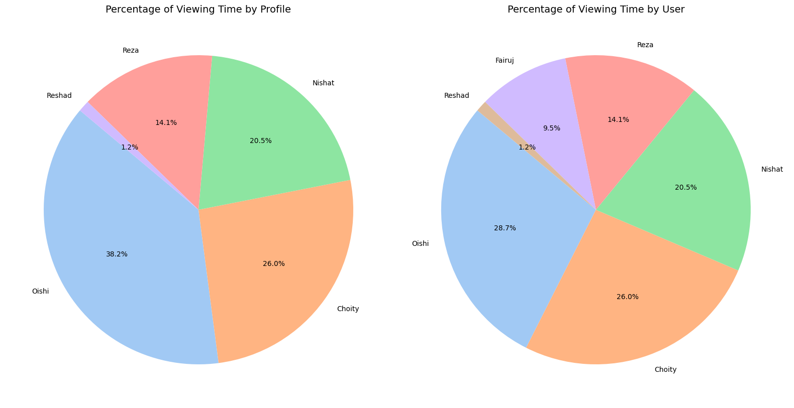
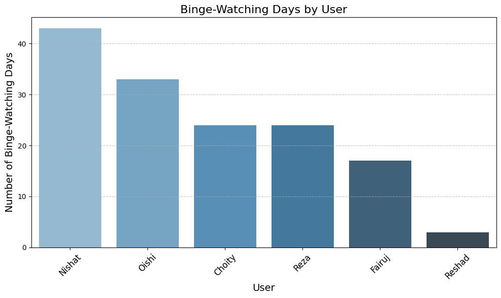
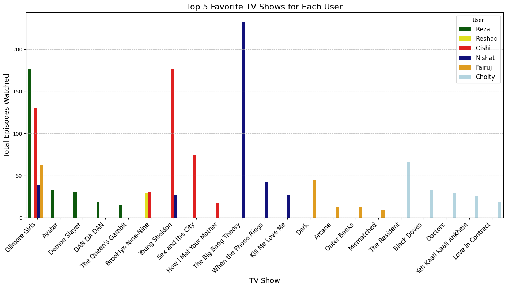

# Netflix Usage Visualizations

This document contains the visual representations of the Netflix family account usage analysis. Each section includes the visualizations, descriptions, and key insights derived from the analysis.

## **1. Viewing Time Analysis by Profile and User**

  

### Objective:  
Understand how each Netflix profile is utilized by family members.

### Key Insights:
- **Oishi's Profile:** Shared between Oishi and Fairuj, with usage distinguishable by location (different countries).
- **Fairuj's Usage:** Regularly uses Netflix but lacks a dedicated profile.
- **Reshad's Profile:** Minimal usage, suggesting the possibility of reallocating this profile to Fairuj for a better user experience.

### Visualization:
- **Left Pie Chart:** Shows the percentage of total viewing time by each profile.
- **Right Pie Chart:** Highlights the viewing time split by user, showing Fairuj's contribution.

### Next Steps:
- Reassign Reshad's profile to Fairuj for enhanced user experience.

## **2. Daily Viewing Time Distribution Analysis**

  

### Visualization:  
- **Box Plot:** Shows the distribution of daily Netflix viewing time for each user.

### Key Insights:
1. **Choyti:**  
   - Most consistent viewer with a median of 2–3 hours daily, though outliers reach up to 8+ hours.
2. **Fairuj:**  
   - Moderate usage with median daily usage just above 1 hour.
3. **Nishat:**  
   - Steady viewing pattern with median daily usage of ~2 hours.
4. **Oishi:**  
   - High usage, with a median of 3–4 hours daily and some days exceeding 6 hours.
5. **Reshad and Reza:**  
   - Minimal activity, rarely exceeding 1 hour/day.

### Interesting Observations:
- **Outliers:**  
  Choyti and Oishi occasionally binge-watch for 8–10 hours.  
- **Low Activity:**  
  Reshad and Reza have the least engagement.

## **3. Weekly Viewing Patterns by User**

  

### Visualization:  
- **Radar Chart (Spider Chart):** Displays how each user distributes their Netflix viewing activity across the days of the week.

### Key Insights:
- **Choyti:** Most active on Monday and Saturday, least active on Sunday.
- **Fairuj:** Consistent usage across the week, peaking on Thursday.
- **Nishat:** Strong engagement on Monday and Friday.
- **Oishi:** Most active on Tuesday and Friday, with minimal activity on Saturday.
- **Reshad:** Limited overall usage, slightly more active on Thursday.
- **Reza:** Low activity but peaks on Sunday.

## **4. Most Binge-Watched TV Shows Across All Users**

  

### Visualization:  
- **Horizontal Bar Plot:** Displays the top 10 binge-watched TV shows across all users.

### Key Insights:
- **Top Shows:**  
  - *Gilmore Girls* leads with the highest number of binge-watching events.  
  - *The Big Bang Theory* and *Young Sheldon* are also highly popular.  
- **Drama & Comedy Favorites:**  
  - Drama shows like *The Resident* and *Dark* are frequently binge-watched.  
  - Sitcoms like *Brooklyn Nine-Nine* and *Sex and the City* are family favorites.  

## **5. Binge-Watching Days by User**

  

### Visualization:  
- **Bar Plot:** Displays the total number of days each user engaged in binge-watching (watching 4+ episodes in one day).

### Key Insights:
- **Nishat:**  
  Leads with over 40 binge-watching days.  
- **Oishi and Choyti:**  
  Significant engagement with 35 and 25 binge-watching days, respectively.  
- **Reshad:**  
  Minimal binge-watching activity.

## **6. Top 5 Binge-Watched Shows by User**

  

### Visualization:  
- **Bar Plot:** Displays the number of binge-watching days for each user's top 5 binge-watched shows.

### Key Takeaways:
- *Gilmore Girls* is the most binge-watched show across multiple users.
- Nishat enjoys binge-watching shows like *The Big Bang Theory* and *Kill Me Love Me*.
- Oishi and Reza favor shows like *Avatar* and *Brooklyn Nine-Nine*.

## **7. Top 5 Favorite Shows by User**

  

### Visualization:  
- **Bar Plot:** Displays the total number of episodes watched for each user's top 5 favorite shows, irrespective of binge-watching.

### Key Takeaways:
- *Gilmore Girls* is a family favorite, with high engagement from Reza and Oishi.
- Nishat leads in watching *Kill Me Love Me*, and Choyti prefers niche titles like *Black Doves*.

## **8. Netflix Messaging Analysis**

### Visualization 1: Click-Through Rate (CTR) by Profile  
  

### Visualization 2: Influence of Messages on Total Views  
  

### Key Insights:
- **CTR Analysis:**  
  - Choyti has the highest CTR (~17.5%), indicating strong engagement.  
  - Nishat follows with a CTR of ~15%.  
  - Other users, like Oishi and Reshad, show negligible engagement.  
- **Message Influence:**  
  - Nishat has the highest message influence (~1.2% of total views).  
  - Reza shows some engagement, but others display little to no impact.

This **README** provides a comprehensive walkthrough of the visual insights generated from the Netflix Family Usage Analysis.
